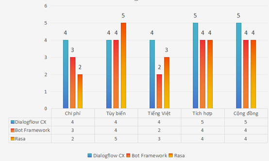

## 2.2. Lựa chọn nền tảng công nghệ

### 2.2.1. Các tiêu chí đánh giá

Nhóm đưa ra 5 tiêu chí để so sánh các nền tảng chatbot phổ biến:

 | **Tiêu chí** |       **Trọng số**    |    **Mô tả** | 
 | ------------------- | --------- | ----------------------------------------- |
  | Chi phí triển khai & vận hành |	30% |	Phù hợp với ngân sách sinh viên, có gói miễn phí hoặc pay-as-you-go |
| Khả năng tùy biến	| 25% |	Cho phép tùy chỉnh luồng hội thoại, tích hợp webhook, API |
| Hỗ trợ ngôn ngữ tiếng Việt |	25% |	Nhận diện và xử lý tốt câu hỏi tiếng Việt (dấu, từ lóng) |
| Tích hợp với Java backend |	10% |	Dễ dàng gọi API từ Java Spring Boot |
| Tài liệu & cộng đồng |	10% |	Có hướng dẫn chi tiết, nhiều người dùng |

### 2.2.2. So sánh các nền tảng

  --------------------------------------------------------------------------
  **Tiêu chí       **Google Dialogflow **Microsoft Bot     **Rasa
  (Trọng số)**     CX**                Framework**         (Open-source)**
  ---------------- ------------------- ------------------- -----------------
  Chi phí (30%)    **4/5** (miễn phí   3/5 (chi phí Azure) 2/5 (tốn server,
                   600 phút/tháng)                         nhân sự)

  Khả năng tùy     4/5 (webhook,       4/5                 **5/5** (hoàn
  biến (25%)       fulfillment)                            toàn tự do)

  Hỗ trợ tiếng     **4/5** (NLU tốt)   2/5                 3/5 (cần tự train
  Việt (25%)                                               thêm)

  Tích hợp Java    **5/5** (REST API   4/5                 4/5
  (10%)            đơn giản)                               

  Tài liệu & cộng  **5/5**             4/5                 4/5
  đồng (10%)                                               

  **Tổng điểm (có  **4.25**            3.40                3.55
  trọng số)**                                              
  --------------------------------------------------------------------------

**Hình 2: So sánh các nền tảng chatbot theo các tiêu chí đánh giá**
.

### 2.2.3. Quyết định lựa chọn

Lựa chọn: Google Dialogflow CX

Phân tích lý do lựa chọn:

- Hỗ trợ tiếng Việt tốt nhất trong các nền tảng cloud

- Có khả năng xử lý hội thoại nhiều ngữ cảnh

- Dễ tích hợp với backend Java thông qua REST API

- Giao diện trực quan, dễ sử dụng

- Chi phí thấp, phù hợp triển khai MVP

Kết luận:

> Dialogflow CX là lựa chọn tối ưu về cả kỹ thuật và chi phí cho dự án.

## 2.3 Phân công thực hiện phân tích & lựa chọn nền tảng

Việc phân tích yêu cầu và lựa chọn nền tảng đã giúp nhóm xác định rõ
hướng phát triển cho hệ thống chatbot SupportBot, đảm bảo đáp ứng tốt
nhu cầu thực tế của doanh nghiệp cũng như tối ưu chi phí và hiệu quả
triển khai.
