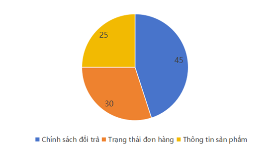

## 2.1. Phân tích yêu cầu

### 2.1.1. Mục tiêu phân tích

Trong bối cảnh hệ thống chăm sóc khách hàng của E-Com Global đang gặp
tình trạng quá tải do số lượng yêu cầu từ khách hàng ngày càng tăng,
việc tích hợp chatbot AI SupportBot là cần thiết nhằm tự động hóa quá
trình hỗ trợ.

Nhóm dự án tiến hành phân tích yêu cầu với các mục tiêu cụ thể như sau:

- Xác định các loại câu hỏi phổ biến từ phía khách hàng

- Hiểu rõ hành vi và nhu cầu của người dùng cuối

- Xây dựng các kịch bản hội thoại phù hợp

- Làm cơ sở cho việc thiết kế và phát triển hệ thống chatbot

- Dữ liệu sử dụng trong quá trình phân tích bao gồm:

- Hơn 10.000 lượt hội thoại từ hệ thống chat và email trong 6 tháng

- Thông tin thu thập từ việc phỏng vấn trưởng bộ phận chăm sóc khách
  hàng

Qua đó đảm bảo yêu cầu được xác định một cách chính xác và sát với thực
tế vận hành.

Phân tích chi tiết

- Nhóm câu hỏi về chính sách chiếm tỷ lệ cao nhất (45%), cho thấy khách
  hàng đặc biệt quan tâm đến quyền lợi sau mua hàng.

- Nhóm đơn hàng (30%) có mức độ phức tạp cao hơn vì cần truy vấn dữ liệu
  thời gian thực thông qua API.

- Nhóm sản phẩm (25%) chủ yếu mang tính tra cứu thông tin, dễ tự động
  hóa.

Kết luận:

- Khoảng 70% câu hỏi có thể xử lý hoàn toàn tự động

- Đây là cơ sở quan trọng chứng minh tính khả thi của chatbot

**Hình 1: Biểu đồ phân bố các nhóm câu hỏi thường gặp
(FAQs)**

### 2.1.2. Phân loại câu hỏi thường gặp (FAQs)

Từ 10.000+ lượt tương tác lịch sử, nhóm đã thống kê và phân loại thành 3
nhóm chính:

  ------------------------------------------------------------------------
  **Nhóm câu    **Tỷ   **Ví dụ minh họa**                    **Mức độ phức
  hỏi**         lệ**                                         tạp**
  ------------- ------ ------------------------------------- -------------
  Chính sách    45%    \"Đổi trả trong bao lâu?\", \"Bảo     Thấp (câu trả
  đổi trả, bảo         hành có tính phí vận chuyển không?\", lời cố định)
  hành                 \"Sản phẩm lỗi có được đổi mới        
                       không?\"                              

  Trạng thái    30%    \"Đơn hàng #ABC123 đã giao chưa?\",   Trung bình
  đơn hàng             \"Khi nào tôi nhận được hàng?\",      (cần gọi API)
                       \"Làm sao để hủy đơn hàng?\"          

  Thông tin sản 25%    \"Laptop X có cổng USB-C không?\",    Thấp (FAQs có
  phẩm                 \"Áo size M tương đương bao nhiêu     sẵn)
                       kg?\", \"Điện thoại Y có màu đen      
                       không?\"                              
  ------------------------------------------------------------------------

### 2.1.3. Xác định các kịch bản hội thoại chính

Dựa trên kết quả phân tích, nhóm xác định 4 kịch bản hội thoại mà
SupportBot cần xử lý:

### 2.1.4. Yêu cầu hệ thống

Yêu cầu chức năng

- Hệ thống chatbot cần đáp ứng các chức năng sau:

- Trả lời tự động các câu hỏi FAQs

- Tra cứu trạng thái đơn hàng thông qua API

- Chuyển tiếp yêu cầu phức tạp đến nhân viên

- Gợi ý sản phẩm dựa trên lịch sử mua

- Lưu trữ toàn bộ lịch sử hội thoại

- Hỗ trợ hội thoại liên tục nhiều lượt

Yêu cầu phi chức năng

- Hiệu năng: thời gian phản hồi \< 3 giây

- Bảo mật: đảm bảo an toàn dữ liệu người dùng

- Khả dụng: hoạt động liên tục 24/7

- Khả năng mở rộng: dễ nâng cấp và mở rộng tính năng

- Đa ngôn ngữ: hỗ trợ tiếng Việt và tiếng Anh

- Quản trị: cung cấp dashboard theo dõi

Yêu cầu bổ sung (sau khi làm việc với khách hàng)

- Gợi ý sản phẩm: Sau khi tra cứu đơn hàng, chatbot có thể gợi ý sản
  phẩm liên quan dựa trên lịch sử mua.

- Lưu lịch sử chat: Toàn bộ hội thoại được lưu vào MySQL để nhân viên
  CSKH xem lại khi cần.

- Dashboard quản trị: Giao diện riêng cho nhân viên CSKH để quản lý các
  cuộc hội thoại đang chờ và lịch sử.
