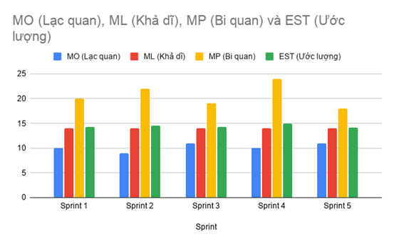
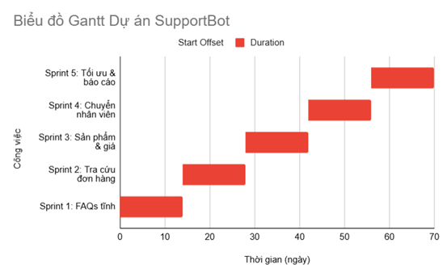
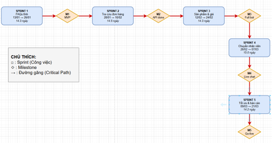

## PHẦN 3: LỰA CHỌN PHƯƠNG PHÁP & KẾ HOẠCH THỜI GIAN

## 3.1. Lựa chọn phương pháp quản lý dự án

### 3.1.1. So sánh các phương pháp

### 3.1.2. Lý do chọn Scrum cho dự án SupportBot

**- Lý do 1: Phát triển theo \"kỹ năng\" (skill-based development)**

Chatbot được chia thành các kỹ năng độc lập: hỏi chính sách, tra cứu đơn
hàng, hỏi thông tin sản phẩm\... Mỗi kỹ năng là một Sprint riêng, không
phụ thuộc nhiều vào nhau.

**- Lý do 2: Liên tục cải thiện chất lượng AI**

Sau mỗi Sprint, nhóm sẽ đo lường **độ chính xác (accuracy)** và **tỷ lệ
hiểu sai (fallback rate)**. Dựa vào đó, Sprint tiếp theo sẽ cải thiện.

**- Lý do 3: Giảm rủi ro sai lệch yêu cầu**

Khách hàng (phòng CSKH) tham gia Sprint Review, phát hiện sớm bot trả
lời sai chính sách → điều chỉnh kịp thời.

**- Lý do 4: Tối ưu ngân sách**

Các tính năng có giá trị kinh doanh cao nhất được ưu tiên làm trước
(chính sách, đơn hàng), đảm bảo ROI ngay cả khi dự án phải dừng sớm.

## 3.2. Cấu trúc Sprint cho dự án SupportBot

### 3.2.1. Xác định thời gian Sprint

Thời gian mỗi Sprint: 2 tuần (14 ngày làm việc)

Lý do chọn 2 tuần: Đủ dài để tạo ra increment có giá trị, đủ ngắn để
phản hồi nhanh với thay đổi

Tổng số Sprint: 5 Sprint

Tổng thời gian dự án: 10 tuần (từ 13/04/2026 đến 21/06/2026)

### 3.2.2. Danh sách các Sprint và mục tiêu

  ---------------------------------------------------------------------------
  Sprint     Thời    Tên Sprint        Mục tiêu chính           Sản phẩm đầu
             gian                                               ra
  ---------- ------- ----------------- ------------------------ -------------
  **Sprint   13/01   Xây dựng kỹ năng  Bot trả lời được câu hỏi Bot text cơ
  1**        --      trả lời FAQs tĩnh về chính sách, bảo hành, bản (MVP)
             26/01                     vận chuyển               

  **Sprint   27/01   Tra cứu đơn hàng  Bot gọi API để tra cứu   Bot có tích
  2**        --      qua API           trạng thái đơn hàng      hợp API
             10/02                     chính xác                

  **Sprint   11/02   Hỏi thông tin sản Bot trả lời thông tin    Bot full tính
  3**        --      phẩm & giá        sản phẩm, giá từ catalog năng cốt lõi
             24/02                                              

  **Sprint   25/02   Chuyển tiếp nhân  Bot phát hiện yêu cầu    Bot + Live
  4**        --      viên & gắn nhãn   phức tạp, chuyển sang    chat
             07/03   ticket            human agent              

  **Sprint   08/03   Tối ưu, giám sát  Dashboard giám sát, load Bot
  5**        --      & báo cáo         test, triển khai         production
             21/03                     production               ready
  ---------------------------------------------------------------------------

## 3.3. Bảng ước lượng PERT (Program Evaluation and Review Technique)

### 3.3.3. Biểu đồ so sánh MO, ML, MP, EST:

**Hình 3: So sánh MO, ML, MP và EST theo Sprint**

**Biểu đồ thanh nhóm:** Mỗi Sprint có 4 cột (MO, ML, MP, EST). Sprint 4
có MP cao nhất (24 ngày) và EST cao nhất (15.0 ngày). Sprint 5 có khoảng
dao động nhỏ nhất (7 ngày).

### 3.3.4. Phân tích độ rủi ro và thời gian dự phòng

**Thời gian dự phòng (Contingency):**

Dự phòng theo EST - ML=72.3−70=2.3 ngày

Dự phòng theo tổng biến động=(∑(*MP*−*MO*))/6​=(10+13+8+14+7)/6​=52/6​/6≈8.7 ngày

## 3.4. Biểu đồ Gantt chi tiết

### 3.4.2. Biểu đồ Gantt dạng trực quan

**Hình 4: Biểu đồ Gantt dạng trực quan**

## 3.5. Sơ đồ mạng PERT (Network Diagram)

**Hình 5: Sơ đồ thể hiện đường găng**
