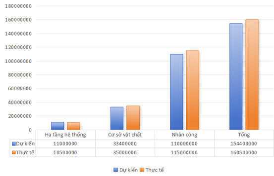

# PHẦN 4: QUẢN LÝ CHI PHÍ DỰ ÁN

## 4.1. Tổng quan chi phí

Chi phí dự án được chia thành 3 nhóm chính:

 | **Nhóm chi phí**           |       **Mô tả** |
  | --------------------------------- | ------------------------------------ |
|  **Chi phí hệ thống** (hạ tầng & công nghệ) |  Máy chủ, nền tảng chatbot, SSL,domain|
 | **Chi phí vận hành** (cơ sở vật chất) |  Điện, internet, đi lại, công cụ thiết kế, bảo trì|
|  **Chi phí nhân công** | phát triển Lương cho 5 thành viên nhóm dự án chatbot |                       
  ----------------------------------------------------------------------

- Việc phân chia này giúp kiểm soát ngân sách và tối ưu hiệu quả triển
  khai.

## 4.2. Chi phí hệ thống (Hạ tầng Chatbot)

Nhận xét:

- Chi phí thấp do sử dụng nền tảng cloud (Dialogflow CX).

- Phù hợp triển khai MVP (Minimum Viable Product) cho chatbot.

- Có thể mở rộng khi cần (tăng dung lượng VPS, nâng cấp gói Dialogflow).

## 4.3. Chi phí cơ sở vật chất

Nhận xét:

- Chi phí vận hành chiếm tỷ lệ trung bình.

- Có dự phòng rủi ro (chi phí phát sinh 9.000.000 VND).

- Bao gồm đầy đủ công cụ thiết kế đồ họa (Photoshop, AI) và phân tích
  (Visual Paradigm).

## 4.4. Chi phí nhân công

Cách tính lương

- Lương theo giờ: 80.000 VNĐ/giờ

- Lương theo ngày: 80.000 × 8 = 640.000 VNĐ/ngày

Việc dự toán chi phí được xây dựng dựa trên mô hình phát triển chatbot
thực tế cho dự án SupportBot của công ty E-Com Global, đảm bảo cân đối
giữa chi phí và hiệu quả.

Trong đó:

- Chi phí hệ thống (11.000.000 VND) chiếm tỷ lệ thấp nhờ sử dụng nền
  tảng cloud Dialogflow CX.

- Chi phí vận hành (33.400.000 VND) ở mức trung bình, có dự phòng cho
  rủi ro phát sinh.

- Chi phí nhân công (110.000.000 VND) chiếm tỷ trọng lớn nhất (khoảng
  70%) do đặc thù của dự án AI, yêu cầu nhiều công sức trong việc huấn
  luyện dữ liệu, tối ưu chatbot và tích hợp API tra cứu đơn hàng.

Tổng chi phí dự án ước tính khoảng 154.400.000 VND (chưa bao gồm
thưởng), phù hợp với ngân sách của một dự án chatbot quy mô vừa, có khả
năng mở rộng và duy trì sau khi bàn giao.

**Hình 6: Biểu đồ so sánh chi phí dự kiến và thực tế dự án
SupportBot**
