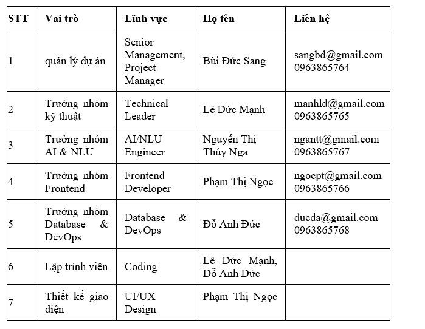
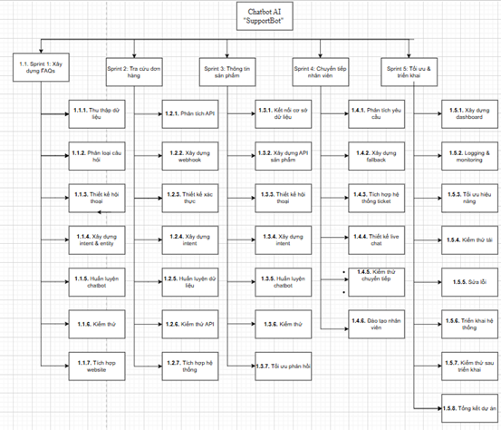

**PHẦN 1: TỔNG QUAN DỰ ÁN**

**1.1. Tổng quan**

Tên dự án: Lập Kế hoạch Tích hợp Chatbot AI \"SupportBot\" vào Website Chăm sóc Khách hàng của công ty \"E-Com Global\".

Mục đích dự án: Dự án được xây dựng dưới yêu cầu của công ty thương mại điện tử E-Com Global với mục đích nhằm tự động hóa hoạt động chăm sóc khách hàng, giảm tải cho bộ phận CSKH, trả lời tự động các câu hỏi thường gặp (FAQs) về sản phẩm, chính sách đổi trả, tình trạng đơn hàng và chuyển tiếp các yêu cầu phức tạp đến nhân viên hỗ trợ, đồng thời nâng cao trải nghiệm mua sắm trực tuyến của khách hàng.

Nhà tài trợ: Công ty E-Com Global

Khách hàng: Công ty E-Com Global

Đơn vị thực hiện: Nhóm sinh viên (Bùi Đức Sang, Lê Đức Mạnh, Phạm Thị Ngọc, Nguyễn Thị Thúy Nga, Đỗ Anh Đức)

Thời gian thực hiện: 8 tuần (dự kiến từ ngày 01/01/2026 -- 30/03/2026)

**1.2. Mô tả dự án**

Công ty thương mại điện tử \"E-Com Global\" đang đối mặt với tình trạng quá tải ở bộ phận chăm sóc khách hàng. Nhóm sinh viên được giao nhiệm vụ quản lý dự án tích hợp một chatbot AI lên website, có khả năng trả lời tự động các câu hỏi thường gặp (FAQs) về sản phẩm, chính sách đổi trả, tình trạng đơn hàng và chuyển tiếp các yêu cầu phức tạp đến nhân viên hỗ trợ.

**1.3. Tài nguyên dự án**

Nhà tài trợ là khách hàng cung cấp toàn bộ chi phí thực hiện dự án.

Khách hàng cung cấp dữ liệu lịch sử chat và email, yêu cầu nghiệp vụ, yêu cầu sửa đổi chức năng dự án.

Trang thiết bị, cơ sở vật chất, không gian làm việc cho nhân viên.

Công ty E-Com Global cung cấp API tra cứu trạng thái đơn hàng.

**1.4. Các bên tham gia**

**1.4.1. Nhà tài trợ**

Công ty E-Com Global

**1.4.2. Khách hàng**

Công ty E-Com Global (đại diện: Ban Giám đốc, Trưởng phòng CSKH, Trưởng phòng IT)

**1.4.3. Các bên liên quan khác**

Người dùng cuối: Khách hàng của E-Com Global (người mua sắm trực tuyến)

Nhà cung cấp công nghệ: Google (Dialogflow CX), nhà cung cấp hosting

**1.4.4. Thành viên đội dự án**

**1.4.5. Công nghệ sử dụng**

Ngôn ngữ lập trình Java, HTML5, CSS3, Jquery/JS, Bootstrap.

Phân tích thiết kế hệ thống: Visual Paradigm 16.04.

Thiết kế đồ họa: Photoshop CC 2018, AI CC 2018.

Thiết kế xây dựng CSDL: MySQL.

Nền tảng AI: Google Dialogflow CX.

**1.5. Cấu trúc phân rã công việc (WBS)**

**1.6. Kế hoạch tổng quan của dự án**

**1.6.1. Khởi tạo dự án**

**Vai trò Người đảm nhận**

- Người xét duyệt Bùi Đức Sang

- Người thực hiện Lê Đức Mạnh, Đỗ Anh Đức, Nguyễn Thị Thúy Nga

- Người tham gia đóng góp Phạm Thị Ngọc

**Danh sách công việc**

5.1.1. Gặp và trao đổi với khách hàng E-Com Global để thu thập yêu cầu về hệ thống chatbot SupportBot.

5.1.2. Tổng hợp và xây dựng báo cáo từ dữ liệu thu thập (lịch sử chat, email, FAQs, yêu cầu nghiệp vụ).

5.1.3. Phân tích các loại câu hỏi thường gặp nhằm xác định các kịch bản hội thoại chính cho chatbot.

5.1.4. Nghiên cứu và đề xuất nền tảng phát triển chatbot, lựa chọn Dialogflow CX.

**1.6.2. Phân tích yêu cầu**

**Vai trò Người đảm nhận**

- Người xét duyệt Bùi Đức Sang

- Người thực hiện Lê Đức Mạnh, Nguyễn Thị Thúy Nga, Đỗ Anh Đức

- Người tham gia đóng góp Phạm Thị Ngọc

**Danh sách công việc**

5.2.1. Phân tích yêu cầu nghiệp vụ (FAQs, tra cứu đơn hàng, thông tin sản phẩm) và yêu cầu hệ thống (tích hợp API, lưu lịch sử hội thoại).

5.2.2. Phân rã yêu cầu thành các chức năng chatbot (intent, entity, kịch bản hội thoại).

5.2.3. Xây dựng kiến trúc hệ thống chatbot: Chat Widget → Dialogflow → Webhook → Database → API hệ thống.

5.2.4. Lập kế hoạch tổng quan dự án theo phương pháp Agile/Scrum (chia thành các Sprint).

5.2.5. Xây dựng WBS chi tiết cho toàn bộ dự án.

**1.6.3. Thiết kế hệ thống**

**Vai trò Người đảm nhận**

- Người xét duyệt Bùi Đức Sang

- Người thực hiện Lê Đức Mạnh, Đỗ Anh Đức

- Người tham gia đóng góp Phạm Thị Ngọc, Nguyễn Thị Thúy Nga

**Danh sách công việc**

5.3.1. Thiết kế kiến trúc tổng thể hệ thống chatbot.

6.3.2. Thiết kế chi tiết luồng hội thoại cho từng kịch bản (FAQs, tra cứu đơn hàng, chuyển nhân viên).

5.3.3. Xây dựng sơ đồ UML (use case, lớp, sequence).

5.3.4. Thiết kế cơ sở dữ liệu (lưu lịch sử chat, người dùng, đơn hàng, FAQs).

5.3.5. Thiết kế giao diện: Giao diện chatbot (chat widget), Dashboard quản trị cho nhân viên CSKH

**1.6.4. Xây dựng hệ thống Chatbot**

**Vai trò Người đảm nhận**

- Người xét duyệt Bùi Đức Sang

- Người thực hiện Lê Đức Mạnh, Phạm Thị Ngọc, Nguyễn Thị Thúy Nga

- Người tham gia đóng góp Đỗ Anh Đức

**Danh sách công việc**

5.4.1. Xây dựng cơ sở dữ liệu phục vụ chatbot (MySQL).

5.4.2. Phát triển giao diện chatbot (chat widget tích hợp vào website).

5.4.3. Thống nhất yêu cầu và giao diện với khách hàng E-Com Global.

5.4.4. Phát triển chatbot: Xây dựng intent, entity; Huấn luyện dữ liệu; Tích hợp webhook gọi API tra cứu đơn hàng

5.4.5. Triển khai theo phương pháp Agile/Scrum với các Sprint:

Sprint 1: FAQs

Sprint 2: Tra cứu đơn hàng

Sprint 3: Thông tin sản phẩm

Sprint 4: Chuyển tiếp nhân viên & tối ưu hệ thống

**1.6.5. Chạy thử hệ thống**

**Vai trò Người đảm nhận**

- Người xét duyệt Bùi Đức Sang

- Người thực hiện Nguyễn Thị Thúy Nga, Lê Đức Mạnh

- Người tham gia đóng góp Phạm Thị Ngọc

**Danh sách công việc**
5.5.1. Xây dựng test case cho từng chức năng chatbot.

5.5.2. Kiểm tra hệ thống:

Độ chính xác câu trả lời

Tỷ lệ hiểu sai intent

Thời gian phản hồi

5.5.3. Ghi nhận lỗi và đề xuất phương án cải thiện.

**1.6.6. Kiểm thử hệ thống**

**Vai trò Người đảm nhận**

- Người xét duyệt Bùi Đức Sang

- Người thực hiện Lê Đức Mạnh, Đỗ Anh Đức

- Người tham gia đóng góp Nguyễn Thị Thúy Nga

**Danh sách công việc**

5.6.1. Triển khai hệ thống lên môi trường thực tế (server/VPS).

5.6.2. Kiểm thử tích hợp toàn bộ hệ thống:

Chat → Dialogflow → Webhook → Database → API

5.6.3. Phát hiện và sửa lỗi trên môi trường thực.

5.6.4. Kiểm thử hiệu năng (nhiều người dùng đồng thời).

5.6.5. Lập báo cáo kiểm thử chi tiết.

**1.6.7. Kết thúc dự án**

**Vai trò Người đảm nhận**

- Người xét duyệt Bùi Đức Sang

- Người thẩm định Bùi Đức Sang, Phạm Thị Ngọc

- Người thực hiện Lê Đức Mạnh, Đỗ Anh Đức, Nguyễn Thị Thúy Nga

**Danh sách công việc**

5.7.1. Xây dựng tài liệu hoàn chỉnh:

Hướng dẫn sử dụng chatbot SupportBot

Hướng dẫn dashboard cho nhân viên CSKH

Tài liệu kỹ thuật hệ thống

5.7.2. Đào tạo nhân viên CSKH của E-Com Global sử dụng hệ thống.

5.7.3. Bàn giao mã nguồn, tài liệu và toàn bộ sản phẩm cho khách hàng.

5.7.4. Kết thúc dự án và triển khai bảo hành trong 01 tháng.
